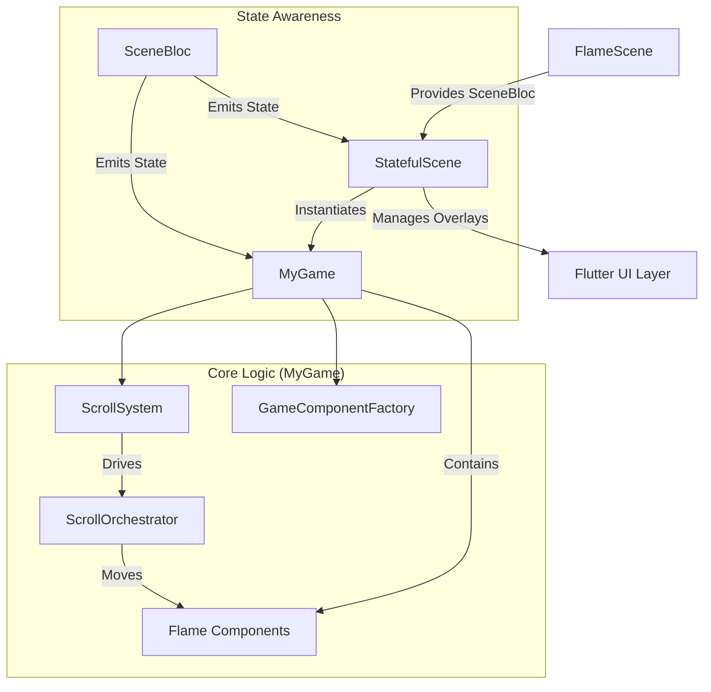

# Architecture Overview

This document maps the core architecture of the portfolio website, tracing the flow from the entry point to the core game logic.

## 1. Entry Point: FlameScene

**Location**: `lib/project/app/views/scene.dart`

The `FlameScene` widget serves as the root entry point for the visual application.

- **Role**: Dependency Injection & Root Structure.
- **Key Responsibilities**:
  - **BlocProvider**: Initializes the `SceneBloc`, which is the central state management logic for the application (handling states like `Loading`, `Title`, `Philosophy`, etc.).
  - **Scaffold**: Provides the basic material design visual layout.
  - **Child**: Instantiates `StatefulScene` to handle the actual view logic.

```dart
// Simplified Structure
class FlameScene extends StatelessWidget {
  build() {
    return BlocProvider(
      create: (_) => SceneBloc()..add(Initialize()),
      child: Scaffold(body: StatefulScene(...)),
    );
  }
}
```

## 2. The Bridge: StatefulScene

**Location**: `lib/project/app/views/stateful_scene.dart`

`StatefulScene` is the bridge between the standard Flutter Widget layer and the Flame Game engine. It handles "State Aware Animation" that exists *outside* or *on top* of the game canvas.

- **Role**: UI Orchestrator & Game Container.
- **Key Responsibilities**:
  - **BlocConsumer**: Listens to `SceneBloc` state changes.
  - **Overlay Animations**: Manages animations that overlay the game, such as:
    - **Curtain Reveal**: The black screen opening animation (`_revealController`).
    - **Loading Text**: The blinking "LOADING" text.
  - **Game Instantiation**: Creates the instance of `MyGame` and passes necessary dependencies (`queuer`, `stateProvider`).
  - **GameWidget**: Renders the `MyGame` instance within the Flutter widget tree.

### State Handling

When `SceneBloc` emits a new state (e.g., `SceneState.logo`):

1. The `listener` triggers UI animations (e.g., reversing the curtain reveal).
2. The `Stack` widget layers the `GameWidget` (bottom) with `HomeOverlay` and `CurtainClipper` (top).

```dart
// Hides complexity of Flutter-Flame boundary
Stack(
  children: [
    GameWidget(game: _game),       // The Flame Game
    HomeOverlay(...),              // Flutter UI Overlays
    AnimatedBuilder(...),          // Curtain Transition
  ]
)
```

## 3. Core Logic: MyGame

**Location**: `lib/project/app/views/my_game.dart`

`MyGame` is the heart of the portfolio, extending `FlameGame`. It allows pixel-perfect control over rendering, update loops, and input handling.

- **Role**: The Game Engine & Logic Core.
- **Key Systems**:
  - **ScrollSystem**: Decouples scroll input from component movement.
  - **ScrollOrchestrator**: Binds scroll offsets to component properties (like Parallax or Opacity).
  - **GameComponentFactory**: Central registry for creating/loading all visual components (`GodRay`, `CinematicTitle`, `ExperiencePage`).
  - **GameAudioSystem**: Manages sound effects triggered by game events.

### Logic Flow

1. **Initialization (`onLoad`)**:
    - Loads all assets and components via `_componentFactory`.
    - Registers the `GameInputController` to handle mouse/touch inputs.
    - Queues `SceneEvent.gameReady()` to tell the Bloc the game engine is running.

2. **State Reaction (`_handleStateChange`)**:
    - `MyGame` listens to the same `SceneBloc` stream as `StatefulScene`.
    - When state changes (e.g., moving from `Title` to `Philosophy`), `MyGame`:
        1. Clears old scroll bindings.
        2. Registers new `ScrollControllers` (e.g., `PhilosophyPageController`) specific to that section.
        3. Updates component visibility (showing/hiding sections).

3. **The Game Loop (`update`)**:
    - Runs every frame.
    - Updates the `ScrollSystem` (processing physics/inertia).
    - Updates specialized animators like `_logoAnimator`.
    - `ScrollOrchestrator` applies the calculated scroll offset to move/fade components.

### Mental Model Map


