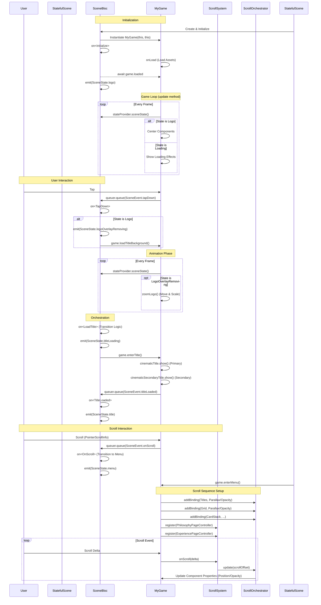
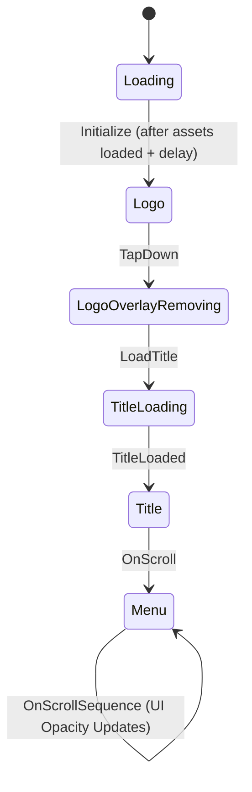

## Scroll Timeline Reference

| Scroll Offset Range | Component | Behavior |
| :--- | :--- | :--- |
| **0 - 500** | `CinematicTitle` | **Opacity Fade Out**: Fades from 1.0 to 0.0. Visible initially, disappears as user scrolls down. |
| **0 - 1000** | `CinematicTitle` & `Secondary` | **Parallax Up**: Moves upwards faster than scroll speed (End Offset: -1000). |
| **0 - 100** | `CinematicSecondaryTitle` | **Opacity Fade Out**: Fades out quickly (0-100). |
| **0 - 100** | `LogoOverlay` (UI) | **Opacity Fade Out**: Interactive UI elements fade out immediately. |
| **0 - 300** | `DimLayer` | **Opacity Fade In**: Darkens the background (0.0 to 0.6). |
| **0 - ~1000** | `BoldTextReveal` | **Sequence**: Controlled by `BoldTextController`. Reveals text "Crafting Clarity..." |
| **4100** | `PhilosophyText` | **Exit**: Philosophy text finishes its sequence/exit. |
| **4200** | `ExperiencePage` | **Enter**: Experience section logic begins (Entrance Start). |
| **4600** | `ExperiencePage` | **Interact**: Interaction phase begins for Experience components. |
| **10200** | `GridComponent` | **Enter**: Grid becomes visible and starts scrolling. |
| **10200 - 10500** | `GridComponent` | **Opacity Fade In**: Fades from 0.0 to 1.0. |
| **10200 - 110200** | `GridComponent` | **Parallax**: Continuous scrolling background pattern. |

### Philosophy Section Timeline (Internal)

Controlled by `PhilosophyPageController`.

| Offset | Component | Action | Details |
| :--- | :--- | :--- | :--- |
| **< 2200** | All | Hidden | Opacity 0.0 |
| **2200 - 2500** | Text & Stack | **Fade In** | Opacity 0.0 -> 1.0 |
| **2500 - 3800** | Text | **Hold** | Remains visible (Static) |
| **2500 - 3800** | Card #0 (Top) | **Peel** | Lifts up, rotates, fades out. |
| **(Dynamic)** | Card #1+ | **Wait -> Reveal -> Peel** | Cards wait for previous to finish, reveal themselves, then peel similarly. Includes delay gaps. |
| **3800 - 4100** | Text | **Exit Slide** | Opacity stays 1.0, slides to the Right (+X). |
| **> 4100** | All | Exited | Hidden or Offscreen |

### Experience Section Timeline (Internal)

Controlled by `ExperiencePageController`.

| Offset | Component | Action | Details |
| :--- | :--- | :--- | :--- |
| **4200 - 4600** | Page | **Entrance/Fade In** | Opacity 0.0 -> 1.0. |
| **4600** | Interaction | **Start** | `localScroll = 0`. |
| **4600 - 9600** | Orbital System | **Rotate** | Rotates based on scroll delta (approx 1 item per 1000px). |
| **4600 - 9600** | Satellites | **Cull/Scale** | Items scale up/fade in when near active angle (9 o'clock), fade out elsewhere. |
| **4600 - 9600** | Text Info | **Switch** | Triggers `MoveTo` animation when index changes. |
| **9600** | Interaction | **End** | `localScroll` maxed out. |
| **9600 - 10600** | Page | **Exit/Warp** | Moves Up (-Y) and Warps (Scale Up) to simulate flying through. |

## Architecture Overview

### Scroll-Driven Architecture

The application uses a dedicated `ScrollSystem` to decouple input handling from component logic. This ensures scalable and manageable scroll sequences.

1. **ScrollSystem**: The central hub that receives scroll deltas from `MyGame`. It maintains the global `scrollOffset` and notifies registered listeners.
2. **ScrollOrchestrator**: A specialized listener that manages `ScrollEffect` bindings. It maps specific scroll ranges to component properties (like position or opacity).
    * *Usage*: `orchestrator.addBinding(component, Effect(start, end, ...))`
3. **Controllers**: Custom logic classes (e.g., `PhilosophyPageController`, `ExperiencePageController`) registered to the `ScrollSystem`. They implement the `ScrollListener` interface to handle complex, non-linear logic that simple bindings can't cover (like triggering animations or state changes at specific points).
4. **Components**: Standard Flame components that are acted upon by the Orchestrator or Controllers. They generally do *not* handle scroll input directly.

### Motion & Timing

* **Scroll vs. Time**:
  * **Scroll-Driven**: Most animations (Parallax, Opacity, specialized entrances) are functions of the `scrollOffset`. They are deterministic and reversible. If the user stops scrolling, the animation stops.
  * **Time-Driven**: Some effects (like the "God Ray" shimmer or Logo hover) run on the game loop (`update(dt)`) independent of scroll.
* **Curves**: `ScrollEffects` support curvature (e.g., `Curves.easeOut`) to make scroll-driven motions feel natural rather than linear.
* **Component Timing**:
  * Define "Tracks" or "Lanes" for your components in the `Scroll Timeline`.
  * Avoid overlapping "Exit" and "Enter" phases of major sections unless intentional (e.g., parallax layering).
  * Use buffers (like the 4100-4200 gap) to ensure clean transitions between heavy scenes.

## Inner Component Breakdown

### Philosophy Section

* **`PhilosophyTextComponent`**:
  * A specialized wrapper around `TextComponent` that implements `OpacityProvider`.
  * **Responsibility**: Displays the "My Philosophy" header.
  * **Visuals**: Uses `ModrntUrban` font with bold weight and simple white color logic.
  * **Interaction**: Managed purely by the `PhilosophyPageController` or Orchestrator for opacity/position. It is largely stateless.

* **`PeelingCardStackComponent`**:
  * **Structure**: Container `PositionComponent` holding a list of `PhilosophyCard`s.
  * **Stacking**: Initializes cards in **Reverse Order** (last index painted first) so index 0 is visually on top (highest priority).
  * **Control**:
    * Exposes `cards` list to the `PhilosophyPageController`.
    * Does *not* contain scroll binding logic internally when used in the full app flow (delegates to Controller).
  * **Cards**: Each `PhilosophyCard` is a visual unit representing a philosophy item (Title + Description).

### Experience Section

* **`ExperiencePageComponent`**:
  * A complex composite component acting as a "Page" scene.
  * **Inner Components**:
    * `OrbitalArcsComponent`: The rotating geometric background (left side).
    * `SatelliteComponent`s: Use `OrbitalArcsComponent.rotation` to position themselves in an elliptical orbit.
    * `TextComponent`s (`Role`, `Company`, `Duration`): Display data for the currently selected node.
    * `ConnectorLine`: Visual link between the orbit and the text content.
  * **Interactions**:
    * **Rotation**: Driven by `updateInteraction(localScroll)`. The rotation is calculated to align the next item based on scroll delta.
    * **Warp Effect**: Implements a `setWarp(progress)` method that scales and positions the entire component to simulate a "warp speed" exit effect.
    * **Content Switching**: Detects index changes based on scroll position and triggers text animations (slide up + fade) via `MoveToEffect`.
  * **Motion**:
    * Uses `lerp` in `update(dt)` for smooth rotation (inertia) so the wheel doesn't snap instantly to scroll position.
    * Satellites are culled (faded/scaled down) based on their angular distance from the "active" zone (9 o'clock position).

#### Deep Dive: Experience Mechanics

The Experience section is highly dynamic, relying on specific math and configurations for its "Orbital Scroll" effect.

**1. Rotation & Orbit Logic**

* **Formula**: `targetRotation = -(localScroll * (pi/4)) / 1200`
  * Effectively maps ~1000px of scroll to 45 degrees (`pi/4`) of rotation.
* **Counter-Rotation**: Satellites apply a counter-rotation (`systemRotation * 1.2`) to their orbit slightly faster than the background arcs, creating a layered depth effect.

**2. Satellite Culling (Focus Effect)**

* **Logic**: Satellites are "Active" when they are near the 9 o'clock position (Angle ~ `pi`).
* **Threshold**: `activeThreshold = 0.35` radians (~20 degrees).
* **States**:
  * **Active**: `Scale 1.2`, `Opacity 1.0`.
  * **Inactive**: `Scale 0.8`, `Opacity 0.2`.
* **Transition**: Linear interpolation based on angular distance from the "Active Zone".

**3. Exit Sequence (Warp)**

* Triggered by `ExperiencePageController` when `scrollOffset > exitStart`.
* **Y-Axis Fly**: The entire component moves up by `-1000px` to simulate lifting off.
* **Scale Warp**: Applies a cubic curve `1.0 + pow(t, 3) * 7.0` to scale the component from `1.0x` to `8.0x`, creating a "warp speed" visual as it exits.

**4. Data Model**

* Driven by `ExperienceNode` objects (Year, Title, Company, Duration, Location).
* Content is lazily updated only when the `index` changes `(scroll / 1000).floor()`.
